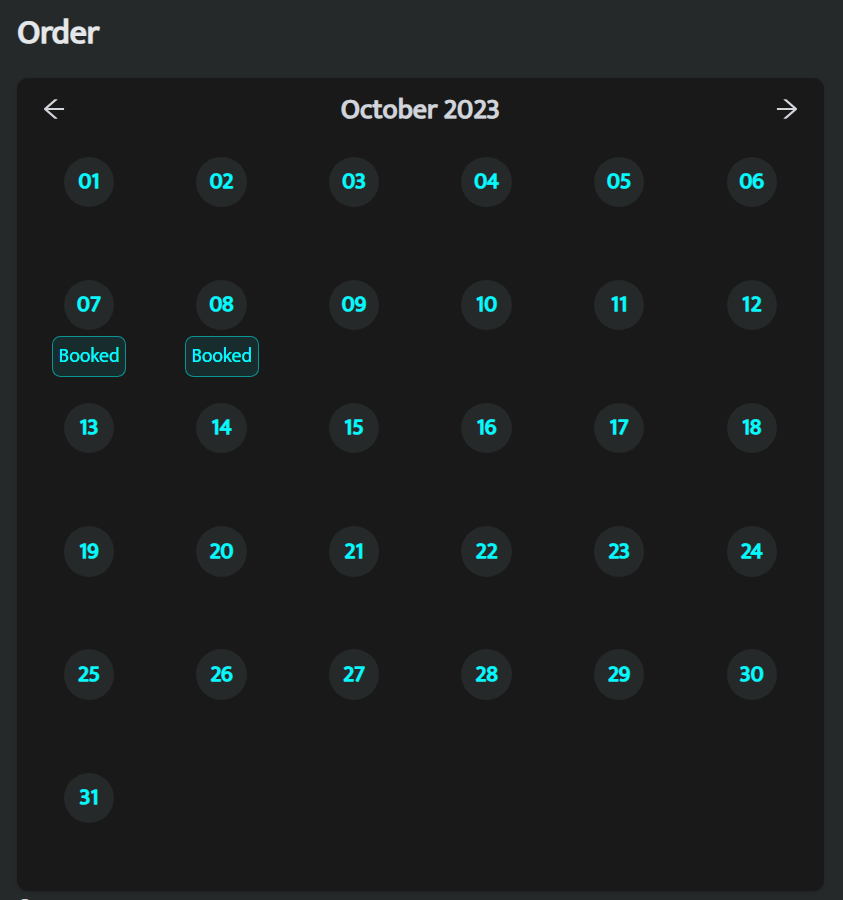
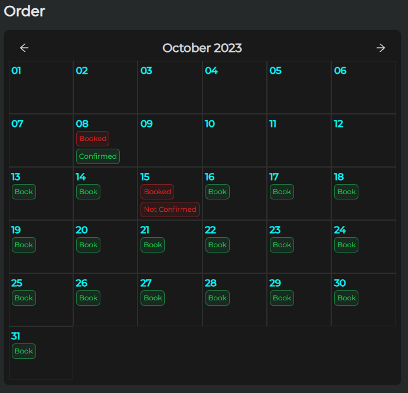
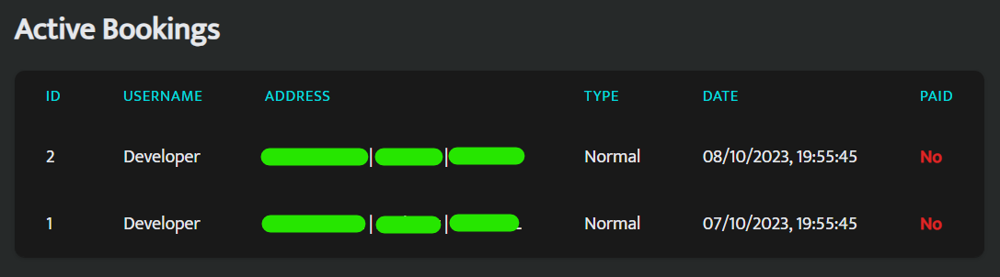
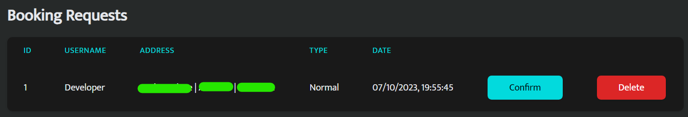

# Booking System

### Clients should be able to view the cleaner's availability and book appointments.

- The client can view the cleaner's availability and book appointments.

### The cleaner should have a calendar to manage and confirm bookings.

- The cleaner can view their calendar and confirm bookings.
- When the client books an appointment, the cleaner will receive a notification and can confirm or reject the booking.
- After the cleaner accepts the booking, the client will be sent a Stripe invoice for the booking where they can pay.

### Notifications (email or push) should be sent to both parties upon booking and confirmation.

- The client and cleaner will receive an email notification when a booking is made.

### Calendar

### Calendar 2

### Active Bookings

### Booking Requests

