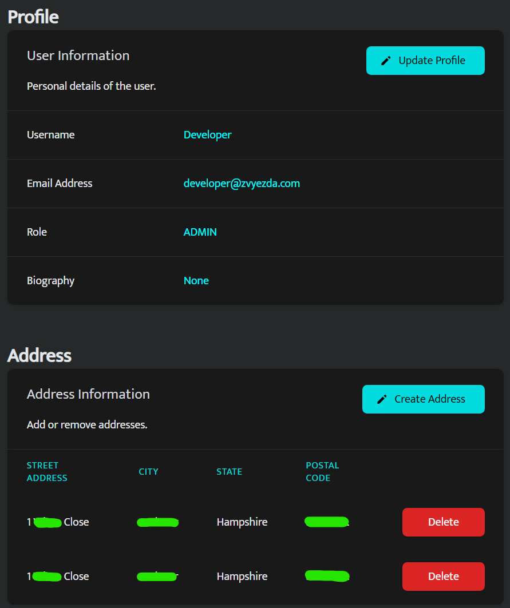
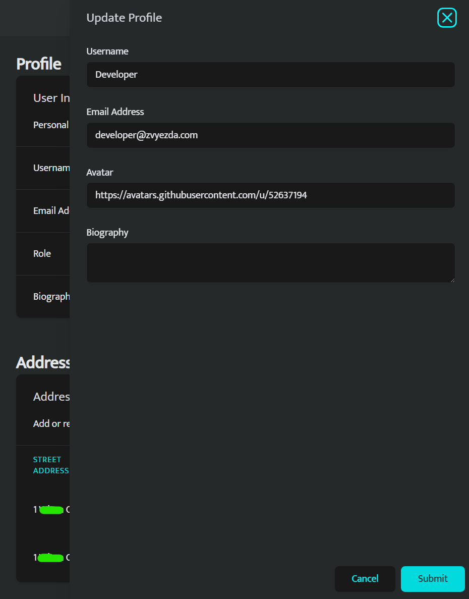
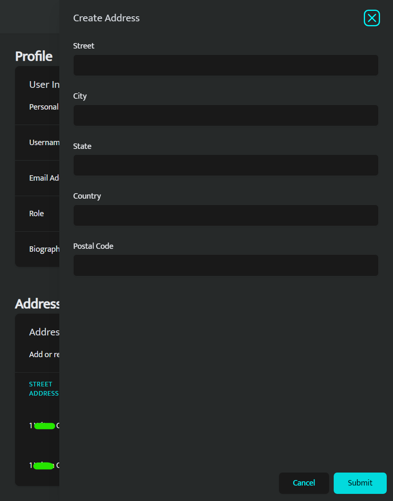

# User Registration and Profiles

### Clients and the cleaner should be able to register and create profiles.

- When registering the client is asked for their email, desired username and password. When the client clicks the register button, assuming there were no errors, the client is logged in and sent the dashboard.
- The password is encrypted using SHA-256 and stored in a Postgres database.
- An Admin will be able to create accounts for people too or using a system I've created in the past, generate an invite code that can be used to create an account with pre-filled information.

### Users should be able to set up and manage their personal information and preferences.

- The client can edit their profile information, including their username, email, phone number and address.

## Designs

### Login

### Register

### Profile

### Edit Profile

### Create Address

